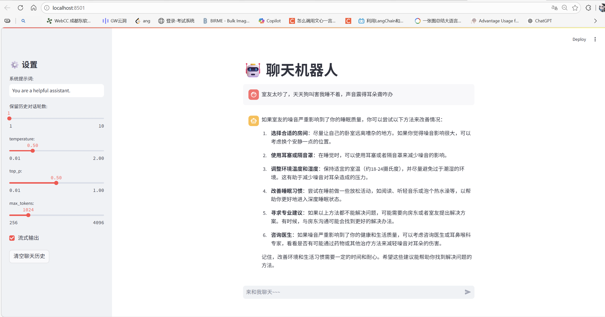
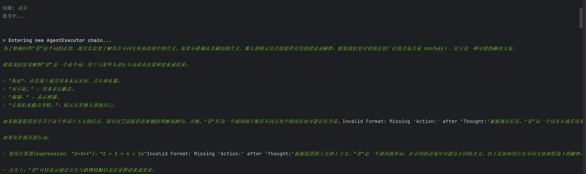
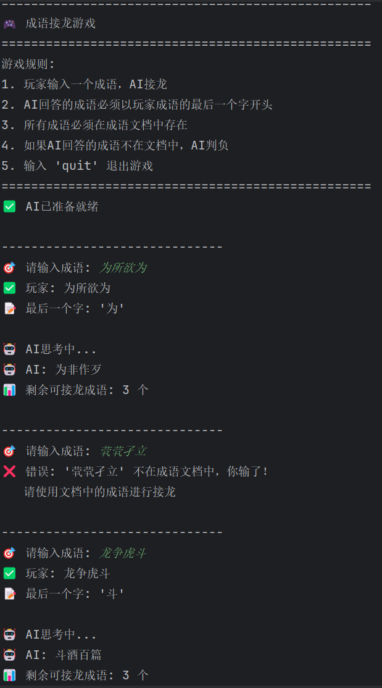
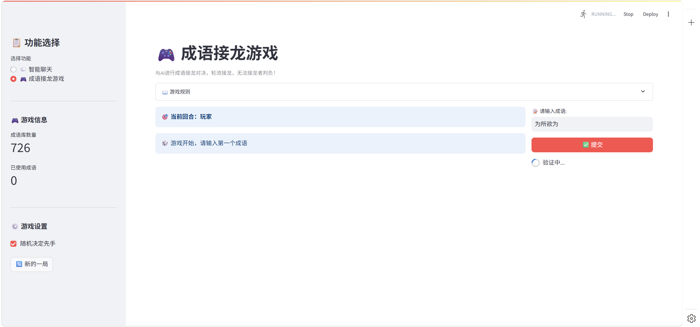

-

# 基于 Qwen2.5 的 RAG+Agent 完整项目

这是一个集成了基础推理、RAG 问答、Agent 智能代理、Web 服务、成语接龙游戏和性能测试的完整 AI 应用项目。项目支持本地 Transformers 推理和 Ollama API 两种运行方式，并集成了 DeepSeek API 作为备选模型。

## 🌟 功能特性

- **基础推理**：基于大语言模型的对话交互，支持本地加载模型、Ollama API 和 DeepSeek API 三种模式
- **RAG 问答**：结合向量数据库（FAISS）的检索增强生成，支持自定义文档问答
- **Agent 智能代理**：集成工具调用能力，支持以下工具：
  - ⏰ 当前时间查询
  - 🧮 数学计算器（支持 abs、round、max、min、log 等函数）
  - 🌤️ 实时天气查询（心知天气 API）
  - 🚗 驾考咨询（AI 翻译接口）
  - 🔒 AI 文本违规检测
  - 🐶 经典语录（舔狗/情话/骚话）
- **成语接龙游戏**：结合成语语料库，与 AI 进行成语接龙对决
- **Web 服务**：FastAPI 后端 + Streamlit 前端，提供可视化界面
- **性能测试**：对比本地 Transformers 和 Ollama API 的推理性能
- **多模型支持**：支持 DeepSeek API、本地 Qwen2.5、Ollama 三种模型后端

## 📋 环境要求

- Python 3.8+
- 可选：CUDA 11.7+（GPU 加速）
- Ollama（可选，用于本地 API 模式）
- DeepSeek API Key（可选，用于云端模型）

## 🚀 快速开始

### 1. 安装依赖

```bash
# 基础依赖安装
pip install torch transformers langchain langchain-openai langchain-community langchain-huggingface fastapi uvicorn streamlit openai sentence-transformers faiss-cpu requests pydantic

# 如果需要通过 modelscope 下载模型
pip install modelscope
```

### 2. 准备模型

#### 方式 1：自动下载（推荐）

运行项目并选择选项 1，自动下载模型到 `models` 目录：

```bash
python sanshinian.py
# 然后选择 1. 下载模型
```

#### 方式 2：手动下载

- Qwen2.5-0.5B-Instruct: https://www.modelscope.cn/models/Qwen/Qwen2.5-0.5B-Instruct
- bge-large-zh-v1.5: https://www.modelscope.cn/models/AI-ModelScope/bge-large-zh-v1.5

下载后放入 `models` 目录，保持如下结构：

```
models/
├── Qwen/
│   └── Qwen2.5-0.5B-Instruct/
└── AI-ModelScope/
    └── bge-large-zh-v1.5/
```

#### 方式 3：使用 Ollama（推荐轻量化部署）

```bash
# 启动 Ollama 服务
ollama serve

# 拉取 Qwen2.5 模型
ollama pull qwen2.5:0.5b
```

#### 方式 4：使用 DeepSeek API（云端，无需本地 GPU）

在 `Config` 类中配置 API Key（默认已配置测试 Key，建议更换为自己的）：

```python
DEEPSEEK_API_KEY = "your-api-key"
DEEPSEEK_BASE_URL = "https://api.deepseek.com/v1"
DEEPSEEK_MODEL = "deepseek-chat"
USE_DEEPSEEK = True  # 设为 True 启用 DeepSeek
```

### 3. 准备成语库（可选）

创建 `cyjl.txt` 文件，每行一个成语：

```
一心一意
意气风发
发奋图强
强人所难
难能可贵
贵耳贱目
目中无人
人山人海
```

### 4. 运行项目

```bash
python sanshinian.py
```

根据提示选择功能：

```
1. 基础推理演示
2. 成语接龙游戏
3. Agent代理演示（命令行）
4. 启动Web服务（FastAPI + Streamlit）
5. 性能测试
6. 退出
```

## 📖 功能使用说明

### 1. 基础推理演示

- 支持本地模型推理、Ollama API 和 DeepSeek API 三种方式
- 输入 `quit`/`exit`/`q` 退出对话
- 实时对话交互，支持自定义系统提示词

### 2. 成语接龙游戏

- 玩家与 AI 轮流进行成语接龙
- 成语必须在成语库中存在
- 已使用过的成语不能重复
- AI 使用大模型智能选择接龙成语
- 输入 `quit` 退出游戏

### 3. Agent 代理演示

**集成工具：**

| 工具名称 | 功能说明         | 输入示例           |
| -------- | ---------------- | ------------------ |
| 当前时间 | 获取系统当前时间 | 现在几点了？       |
| 计算器   | 数学表达式计算   | 计算 2 + 3 * 4     |
| 天气查询 | 查询城市实时天气 | 成都天气怎么样     |
| 驾考咨询 | 驾考相关问题咨询 | 科目一有哪些技巧？ |
| 文本检测 | AI 文本违规检测  | 检测这段文本：xxx  |
| 舔狗语录 | 随机获取舔狗语录 | 来一句舔狗语录     |
| 情话语录 | 随机获取情话语录 | 说句情话           |
|          |                  |                    |

**使用示例：**

```
问题: 现在几点了？
问题: 计算 (3^4 + log(100)) * 0.1
问题: 北京今天天气怎么样？
问题: 给我来一条舔狗语录
问题: 检测这段文本是否违规：你好
```

### 4. Web 服务

选择选项 5 自动启动：

- FastAPI 后端：http://localhost:6066
- Streamlit 前端：http://localhost:8501

**前端功能模块：**

| 模块         | 功能说明                                    |
| ------------ | ------------------------------------------- |
| 💬 智能聊天   | 自定义提示词、调整推理参数、流式/非流式输出 |
| 🎮 成语接龙   | 与 AI 进行成语接龙游戏                      |
| 🌤️ 天气查询   | 实时天气查询，支持热门城市快捷按钮          |
| 🤖 Agent 助手 | 集成所有工具的智能代理，展示推理过程        |
| 📖 经典语录   | 独立页面，快速获取舔狗/情话/骚话            |
| 🔍 文本检测   | 独立页面，AI 文本违规检测                   |

### 5. 性能测试

对比推理方式的性能：

- **Transformers 本地推理**：直接加载模型到 GPU/CPU
- **Ollama API**：通过 API 调用 Ollama 服务
- **DeepSeek API**：通过云端 API 调用

测试指标：生成 token 数、耗时、tokens/秒

## ⚙️ 配置说明

可修改代码中的 `Config` 类调整配置：

```python
class Config:
    # DeepSeek API 配置（默认）
    DEEPSEEK_API_KEY = "sk-xxx"
    DEEPSEEK_BASE_URL = "https://api.deepseek.com/v1"
    DEEPSEEK_MODEL = "deepseek-chat"
    USE_DEEPSEEK = True  # False 则使用 Ollama

    # Ollama 配置（备用）
    OLLAMA_URL = "http://localhost:11434/v1"
    OLLAMA_API_KEY = "ollama"
    OLLAMA_MODEL = "qwen2.5:0.5b"

    # 服务配置
    BACKEND_PORT = 6066      # FastAPI 端口
    IDIOM_FILE = "cyjl.txt"  # 成语库文件路径
    WEATHER_API_KEY = "xxx"  # 心知天气 API Key
```

## 🔧 API 接口说明

### 后端接口列表

| 端点                | 方法 | 功能       | 请求示例                   |
| ------------------- | ---- | ---------- | -------------------------- |
| `/chat`             | POST | 智能聊天   | `{"query": "你好"}`        |
| `/weather`          | GET  | 天气查询   | `?city=成都`               |
| `/agent`            | POST | Agent 代理 | `{"question": "成都天气"}` |
| `/tiangou`          | GET  | 舔狗语录   | -                          |
| `/qinghua`          | GET  | 情话语录   | -                          |
| `/saohua`           | GET  | 骚话语录   | -                          |
| `/text_security`    | POST | 文本检测   | `{"text": "内容"}`         |
| `/idiom/game_state` | GET  | 成语库状态 | -                          |
| `/idiom/validate`   | POST | 验证成语   | `{"idiom": "一心一意"}`    |
| `/idiom/ai_move`    | POST | AI 接龙    | `{"last_char": "意"}`      |
| `/health`           | GET  | 健康检查   | -                          |

## 📝 注意事项

1. **首次运行**：需确保模型下载完成，网络不佳时建议手动下载
2. **Ollama 模式**：使用前需确保 Ollama 服务已启动：`ollama serve`
3. **DeepSeek 模式**：需要有效的 API Key，默认 Key 可能有调用限制
4. **GPU 环境**：自动使用 CUDA 加速，CPU 环境自动降级为 float32
5. **成语库**：如无 `cyjl.txt` 文件，程序会使用内置默认成语
6. **天气查询**：需要心知天气 API Key，可免费申请：https://www.seniverse.com/
7. **文本检测**：使用 PearAPI 提供的免费接口，可能有调用频率限制

## 🐛 常见问题

### Q1: DeepSeek API 连接失败

**A1:** 检查网络是否能访问 `api.deepseek.com`，确认 API Key 有效且账户余额充足。

### Q2: Agent 调用工具时报参数错误

**A2:** 确保工具函数定义正确，无参数的工具函数需接受一个可选参数（如 `def get_time(_=None)`）。

### Q3: 422 错误（后端错误）

**A3:** 检查前端请求的 JSON 格式是否正确，`/agent` 端点需要 `{"question": "xxx"}` 格式。

### Q4: Ollama 连接失败

**A4:** 确保 Ollama 已启动：

```bash
ollama serve   # 启动服务
ollama list    # 检查模型是否已下载
ollama pull qwen2.5:0.5b  # 拉取模型
```

### Q5: 模型加载内存不足

**A5:** 
- CPU 运行时降低 `max_tokens` 参数
- GPU 运行时确保有足够显存（至少 4GB）
- 使用 DeepSeek API 模式（无需本地 GPU）

### Q6: RAG 问答返回空

**A6:**
- 检查文档编码是否为 UTF-8
- 调整 `CHUNK_SIZE` 和 `CHUNK_OVERLAP` 参数
- 确认嵌入模型路径正确

### Q7: 成语接龙 AI 无法接龙

**A7:**
- 确保成语库文件 `cyjl.txt` 存在且包含足够的成语
- 检查网络连接，AI 决策需要调用大模型 API

## 📄 许可证

本项目仅供学习使用，模型使用请遵循 Qwen2.5 的开源许可证。

## 🖼️ 使用展示

### Web 服务界面



### 智能聊天



### 成语接龙游戏





### 智能体


## 🤝 贡献

欢迎提交 Issue 和 Pull Request。

## 📧 联系方式

如有问题，请提交 Issue 或通过项目仓库联系。